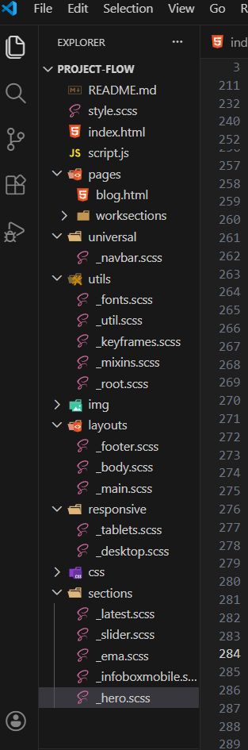
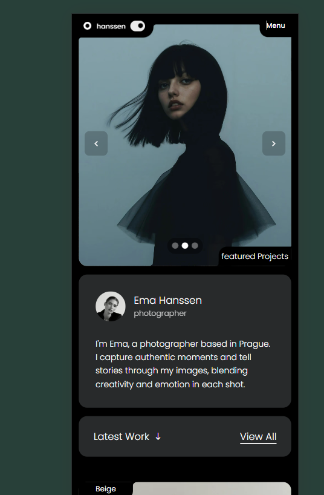

# Ema Hanssen - Premium Portfolio Clone

🔗 **Live Demo:** [ema-hanssen.vercel.app](https://ema-hanssen.vercel.app/)

### 🚀 Overview
This project is a 1:1 pixel-perfect clone of a premium Awwwards-style portfolio template. Instead of relying on a drag-and-drop builder or heavy frameworks, this entire architecture was reverse-engineered from scratch using **Raw SCSS, CSS Grid, and Vanilla JavaScript**. 

The goal was to deeply understand complex DOM rendering, responsive sub-pixel math, and custom state-based animation loops.

### ⚡ Performance & Architecture
* **120 - 144 FPS Rendering:** Optimized paint operations, hardware-accelerated CSS transforms (`translateZ`), and an `IntersectionObserver` scroll engine ensure buttery-smooth performance even on mobile devices.
* **Modular SCSS:** Built with a highly scalable, component-based SCSS architecture (`utils/`, `layouts/`, `sections/`, `responsive/`) for maintainable styling without CSS bloat.

### 🏗️ Core Engineering Features
* **Custom Vanilla JS Slider Engine:** Engineered a state-based image slider from scratch. Features precise `translateX(100%)` and `-100%` routing, synchronized dynamic pagination dots tied strictly to the array index, and flawless transition resets.
* **Complex CSS Geometry:** Replicated premium, curved UI cutouts (inverted border-radius) using pure CSS `box-shadow` and pseudo-elements instead of relying on external SVGs.
* **Independent Scroll Zones:** Built a mathematical split-screen layout using CSS `calc()` and viewport units (`dvh`) to lock the sticky header in place while preventing layout collisions on the scrolling grid.
* **Custom Mobile Navigation:** Engineered a mobile-first off-canvas menu overlay with trapped scroll focus (`overscroll-behavior: none`), preventing background scroll-bleed on iOS/Android devices.
* **Premium Dark Mode:** Implemented a high-contrast dark theme via local storage and CSS variables that flips the visual hierarchy and makes the photography pop.

### 🛠️ Tech Stack
* **HTML5** (Semantic structuring)
* **SCSS** (Variables, nesting, mixins, and advanced modular architecture)
* **Vanilla JavaScript** (ES6+, DOM manipulation, IntersectionObserver, interval logic)

### ⏭️ Next Steps
* **React Port:** The underlying Vanilla JS logic (state management, index tracking, array mapping) was built specifically to prepare this architecture for a clean port into React.js.

---images 

*Built with grit, raw code, and a lot of caffeine.*